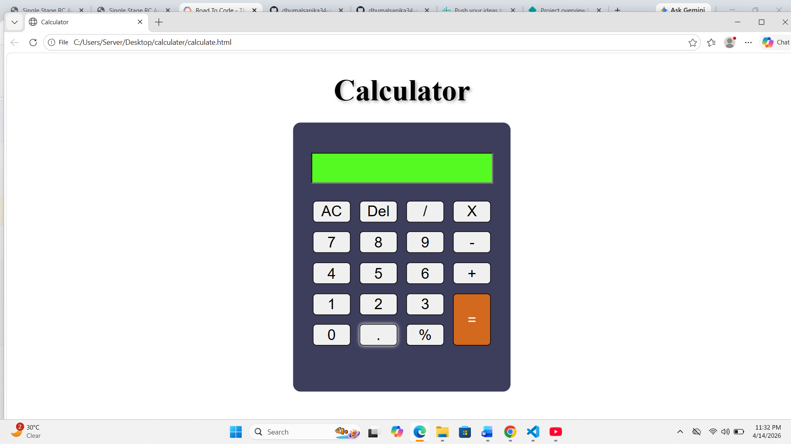

# Simple Web Calculator

A clean and functional calculator web application built as part of a front-end development assignment. This project demonstrates the use of **HTML5**, **CSS3**. to create an interactive user interface.

**Output**

## 🚀 Features
* **Arithmetic Operations:** Addition, subtraction, multiplication, and division.
* **Special Functions:** * `AC`: Clear the entire display.
    * `Del`: Remove the last digit entered (Backspace).
    * `%`: Calculate percentages.
* **Modern UI:** A dark-themed container with a vibrant green display screen for high contrast.
* **Responsive Layout:** Uses CSS Flexbox for a consistent button grid.

## 🛠️ Built With
* **HTML5:** For the structure and semantic elements.
* **CSS3:** For styling, including Flexbox, border-radius, and custom color palettes.

## 📂 Project Structure
* `index.html`: The main structure containing the input screen and button grid.
* `calculator.css`: External stylesheet managing the layout and visual design.

## 🖥️ How to Use
1. Clone or download this project folder.
2. Open the `index.html` file in any modern web browser.
3. Use the on-screen buttons to perform calculations.

## 💡 Code Highlights
### Flexbox Grid
The buttons are arranged using `flex-wrap: wrap` and `justify-content: space-between` to ensure they align perfectly within the calculator body regardless of screen scaling.

### Event Handling
Each button uses an `onclick` attribute to trigger specific JavaScript functions:
* `pick(val)`: Appends the value to the screen.
* `clr()`: Resets the input field.
* `solve()`: Evaluates the mathematical string.

---
